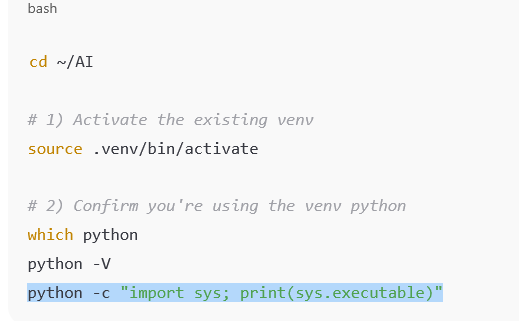
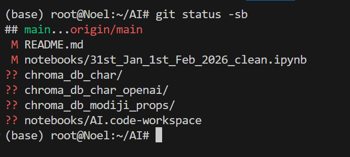

 AI RAG Project

This project contains experiments and development work related to Retrieval-Augmented Generation (RAG) and AI workflows.

---

## 📦 Project Structure

AI/
├── notebooks/ # Jupyter notebooks
├── src/ # Python source code
├── .venv/ # Virtual environment (NOT committed)
├── .env # API keys and secrets (NOT committed)
├── .env.example # Template for environment variables
├── requirements.txt # Python dependencies
├── README.md

# On terminal

# CTRL (Strg) + SHIFT Button above Strg + E 
Exit extension viewClose specfic extensions
# CTRL (Strg) + SHIFT Button above Strg + F
Close speific extension
 

---

## 🐍 Python Setup

### 1️⃣ Check Python Version
python3 --version

---

### 2️⃣ Create Virtual Environment
conda deactivate 
This removes base
source .venv/bin/activate
pip freeze 
gives you list of installed packages

pip freeze > requirements-lock.txt
# For reproducibility

---

### 4️⃣ Upgrade pip + Install dotenv
pip install -U pip python-dotenv

---

## 🔐 Environment Variables

Create `.env` file:

nano .env

Example:
OPENAI_API_KEY=
OPENROUTER_API_KEY=
APP_NAME=AI
APP_URL=http://localhost

---

## ⚠️ Security Rules

Never commit:

.env
.venv/

---

## 📄 .gitignore
.env
.venv/
pycache/
.ipynb_checkpoints/

---

## 📦 Install Dependencies

pip freeze > requirements.txt
pip install -r requirements.txt

---

## ▶️ Running Python With .env

Example:

from dotenv import load_dotenv
import os

load_dotenv()

print(os.getenv("OPENAI_API_KEY"))

---

## 💡 Development Workflow

1. Activate environment
2. Install dependencies
3. Update `.env`
4. Run notebooks / scripts

---

# Desktop to Ubuntu
cd find . -iname "*modi*" | less
find . -iname "*gandhi*" | less
cp "./Papa/Outskill_AIGF_Engineering_Material/Jan30and31/kb_modiji.txt" ~/AI/
python --version
python3 -m venv .venv
source ai_env/bin/activate
which python
# /root/AI/ai_env/bin/python
python --version
# Python 3.11.14
pip install -U pip python-dotenv
# Upgrades to latest vesion
# 👉 Loads environment variables from .env file into Python
AI_RAG_PROJECT/
 ├── notebooks/
 ├── src/
 ├── ai_env/
 ├── .env
 ├── .env.example
 ├── .gitignore
 ├── requirements.txt
 └── README.md

.venv/
 ├── python
 ├── pip
 ├── langchain
 ├── openai
 └── packages

git status -sb

# main = Currenly on main branch
# m = modified files
# ?? = Untracked files (These are vector databasese)
# Vector databases should not be tracked (Embeddings + Index files + Metadata + Binary Storage)
## Reason: Large, Regeneratable, Machine-specific, May expose API/embedding configs
git add .
git commit -m "Upload complete folder"
git push

# Sync with Windows
rsync -av ~/AI /mnt/c/Users/grove/OneDrive/Desktop/Papa/Outskill_AIGF_Engineering_Material/

# Always add vector database to gitignore after generating new vector databases

RAG Application Dependency Tree
├── numpy (base)
├── pandas (base)
├── scikit-learn (metrics)
├── python-dotenv (config)
├── LangChain Stack
│   ├── langchain (core framework)
│   ├── langchain-core (abstractions)
│   ├── langchain-community (integrations)
│   ├── langchain-text-splitters (chunking)
│   ├── langchain-openai (GPT models)
│   ├── langchain-huggingface (embeddings)
│   └── langchain-chroma (vector store)
├── Embeddings
│   ├── transformers (models)
│   └── sentence-transformers (sentence embeddings)
└── Vector Database
    ├── chromadb (storage)
    └── pysqlite3 (Colab fix)

    # https://claude.ai/chat/a70e64d7-089a-49ad-8ada-0b26341e7eb1#python-standard-library

    cp "/mnt/c/Users/grove/Downloads/Packages_Methods.md" ~/AI/
    cp "/mnt/c/Users/grove/Downloads/Installation_guide.md" ~/AI/
g